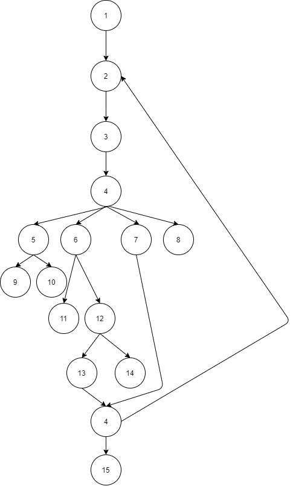

# Втора лабораториска вежба по Софтверско инженерство

## Виктор Бошески, бр. на индекс 196095

### Група на код:

###  Control Flow Graph

### Цикломатска комплексност
CYC = E – N + 2P
CYC = 17 - 15 + 2*5 = 12
Цикломатската комплексност на овој код е 12 и истата ја добив преку горенаведената формула за пресметување.
Е означува број на рабовите кои ги поврзуваат јазлите или таканаречени трансфери на контрола, ги имаме 17.
N означува број на јазли во графот или секвенцијална група на изјави кои содржат само еден трансфер на контрола, и во нашиот случај изнесуваат 15.
P означува број делови од графот кои се исклучуваат или со други зборови каде што програмата ни паѓа или завршува, и во нашиот случај имаме 5. 
Со тоа, ние сме ја пресметале цикломатската комплексност на нашиот код.
### Тест случаи според критериумот Every Branch

    @Test
    public void test1() {
        Time time = new Time(-1,0,0);

        List<Time> timesList = new ArrayList<>();
        timesList.add(time);
        try{
            SILab2.function(timesList);
        }
        catch (Exception e){
            assertEquals(e.getMessage(),"The hours are smaller than the minimum");
        }
    }
    @Test
    public void test2(){
        Time time = new Time(25,0,0);
        List<Time> timesList = new ArrayList<>();
        timesList.add(time);
        try{
            SILab2.function(timesList);
        }
        catch (Exception e){
            assertEquals(e.getMessage(),"The hours are grater than the maximum");
        }
    }
    @Test
    public void test3(){
        Time time = new Time(22,60,0);
        List<Time> timesList = new ArrayList<>();
        timesList.add(time);
        try{
            SILab2.function(timesList);
        }
        catch (Exception e){
            assertEquals(e.getMessage(),"The minutes are not valid!");
        }
    }
    @Test
    public void test4() {
        Time time = new Time(12,34,48);
        List<Time> timesList = new ArrayList<>();
        List<Integer> result;
        timesList.add(time);
        result = SILab2.function(timesList);
        assertEquals(result.get(0).intValue(),time.getHours()*3600 + time.getMinutes()*60 + time.getSeconds());
    }
    @Test
    public void test5(){
        Time time = new Time(22,30,-5);
        List<Time> timesList = new ArrayList<>();
        timesList.add(time);
        try{
            SILab2.function(timesList);
        }
        catch (Exception e){
            assertEquals(e.getMessage(),"The seconds are not valid");
        }
    }
    @Test
    public void test6() {
        Time time = new Time(24,0,0);
        List<Time> timesList = new ArrayList<>();
        List<Integer> result;
        timesList.add(time);
        result = SILab2.function(timesList);
        assertEquals(result.get(0).intValue(),time.getHours()*3600 + time.getMinutes()*60 + time.getSeconds());
    }
    @Test
    public void test7(){
        Time time = new Time(24,30,5);
        List<Time> timesList = new ArrayList<>();
        timesList.add(time);
        try{
            SILab2.function(timesList);
        }
        catch (Exception e){
            assertEquals(e.getMessage(),"The time is greater than the maximum");
        }
    }

### Објаснување на напишаните unit tests

##### Тестови според критериумот Every branch

##### Тест 1:

Во првиот тест случај се тестира дали часовите се помали од дадениот минимум. Ако тој услов е исполнет, кодот ни фрла исклучок што значи нашиот тест ќе помине.
Затоа во овој тест случај вредноста на часовите е -1 , што е вредност за кодот да падне.

##### Тест 2:

Исто како и предходниот тест само што овој пат тестираме дали часовите се поголеми од максимумот.
Во овој тест случај вредноста на часовите е 25, што е вредност за кодот да падне.

##### Тест 3:

Во тест 3 проверуваме дали вредноста на минутите е валидна (помегу 0 и 59). 
Затоа во тест случајот вредноста на минутите е 60 , што е невалидна вредност и тестот ќе биде успешен.

##### Тест 4:

Во овој тест гледаме доколку часовите, минутите и секундите се со валидни вредности и се пресметува формулата.

##### Тест 5:

проверуваме дали вредноста на секундите е валидна (помегу 0 и 59). 
Затоа во тест случајот вредноста на секундите е -5 , што е невалидна вредност и тестот ќе биде успешен.

##### Тест 6:

Во овој тест испитуваме случајот каде часовите се точно 24, а минутите и секундите 0. Потоа се пресметува по формула.

##### Тест 7:

Во овој тест испитуваме случајот каде часовите се точно 24, а минутите и секундите се различни од 0.
Со што програмата ни фрла исклучок.